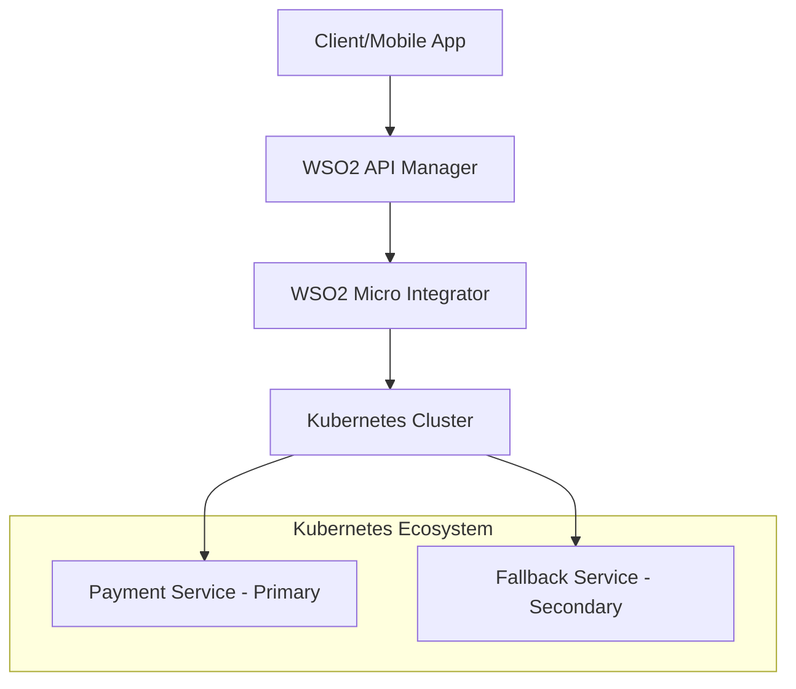
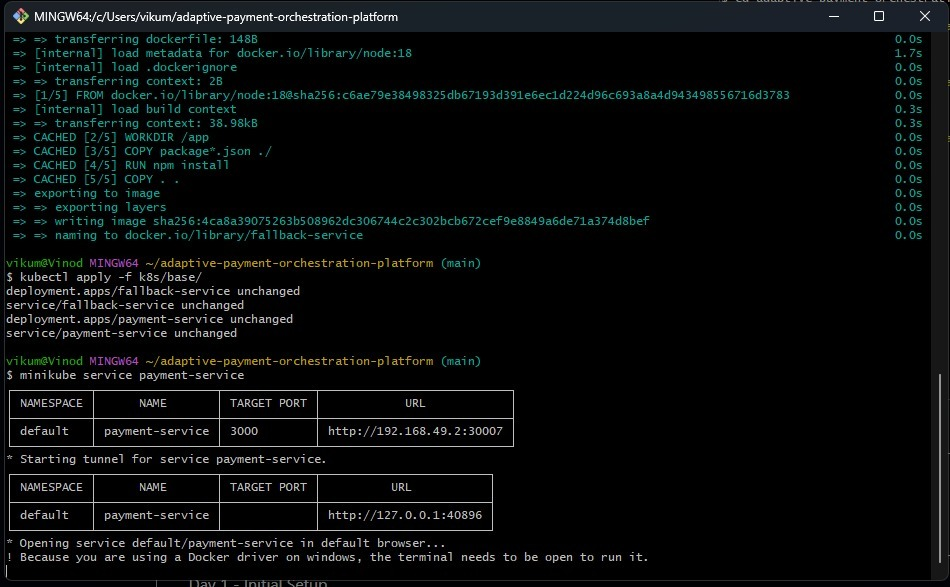
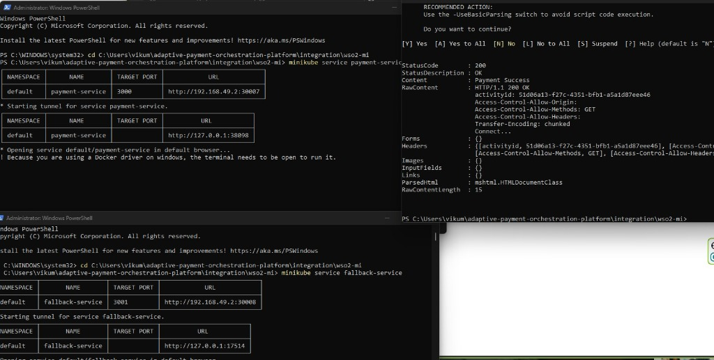
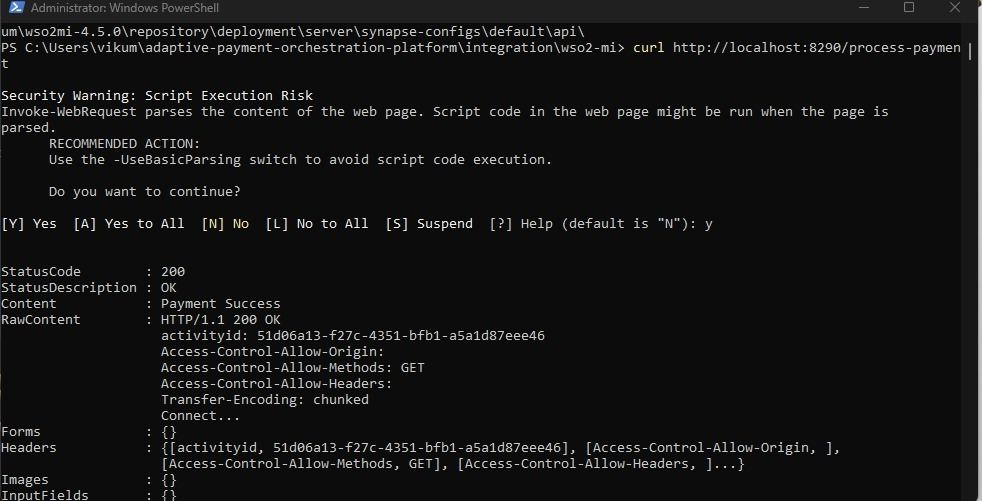
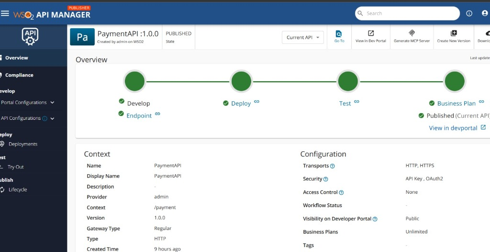
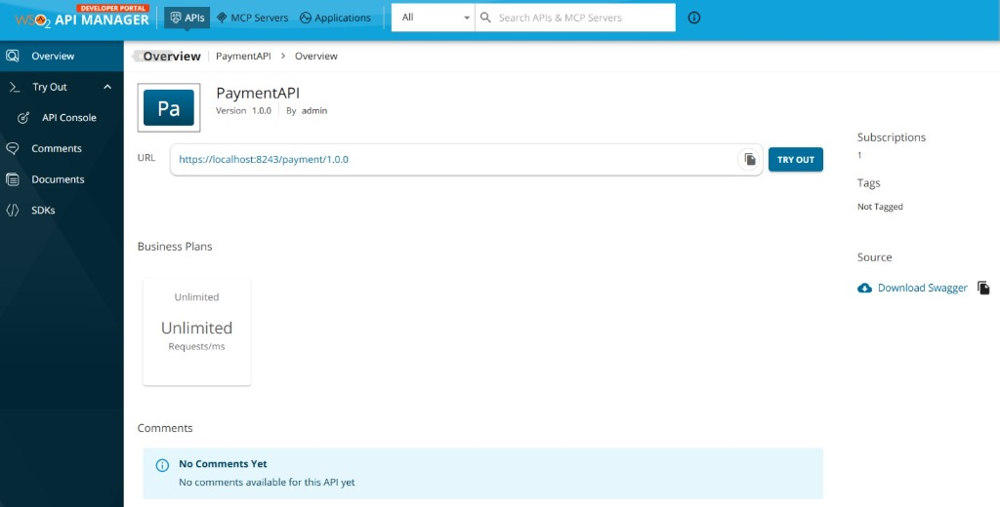
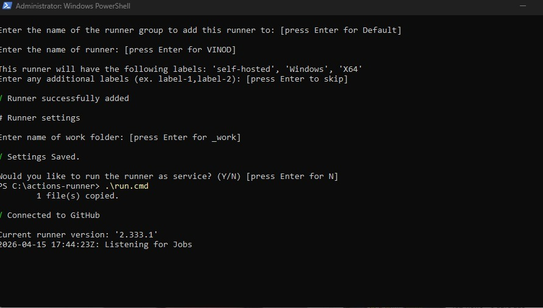

# Adaptive Payment Orchestration Platform 🛡️💳

A high-performance, resilient payment orchestration system built with **WSO2**, **Kubernetes**, and **Dockerized Microservices**. This platform features advanced automated failover mechanisms and a professional CI/CD pipeline.

---

## 🏗️ System Architecture

The platform follows a multi-tier enterprise architecture designed for maximum availability and security.

1.  **Client Tier**: External consumers access the platform via secure API endpoints.
2.  **API Management Tier**: **WSO2 API Manager** handles authentication (OAuth2/API Key), rate limiting, and analytics.
3.  **Integration Tier**: **WSO2 Micro Integrator** performs complex orchestration, transformation, and automated failover routing.
4.  **Service Tier**: Dockerized Node.js microservices running on **Kubernetes (Minikube)**.

---

## 🚀 Key Features

### 1. Intelligent Automated Failover
The platform implements a "Production-Level" failover system. When the Primary Payment Service encounters a business-level failure (modeled as HTTP 500), the Orchestration Layer automatically reroutes the request to a Secondary Fallback Service.

> [!IMPORTANT]
> **The Fix**: Previously, the system passed raw "Payment Failed" messages with HTTP 200 statuses back to the client. We fixed this by:
> -   Updating the Microservice to return correct **HTTP 500** status codes on failure.
> -   Implementing **Mediation Logic** in WSO2 MI to detect these 500 errors and trigger the fallback route.

### 2. Kubernetes Resilience
Services are deployed as resilient Pods within a Kubernetes cluster, ensuring that the infrastructure is self-healing and scalable.

### 3. CI/CD Integration
The project uses **GitHub Actions** with self-hosted runners to automate the build and deployment process directly on local infrastructure, providing a developer-friendly "Internal Developer Platform" experience.

---

## 📸 Documentation & Verification

### Kubernetes Deployment & Infrastructure
We use Minikube to orchestrate our containers. The following screen shows the successful deployment and service tunneling process.

*Figure 1: Docker builds and Kubernetes deployment logs.*

*Figure 3: Minikube tunnel setup for local access to cluster services.*

### API Orchestration (WSO2 Micro Integrator)
The Micro Integrator serves as the brain of the platform, managing the failover logic between the primary and fallback endpoints.

*Figure 4: Direct verification of the Micro Integrator endpoint.*

### API Governance (WSO2 API Manager)
The API is governed and published via WSO2 API Manager to ensure secure and controlled access.

*Figure 5: The PaymentAPI published in the WSO2 Publisher Portal.*

*Figure 6: The API ready for consumption in the Developer Portal.*

### CI/CD Pipeline Status
Our automation is powered by a dedicated self-hosted runner, ensuring that every code change is verified and deployed instantly.

*Figure 7: GitHub Actions self-hosted runner listening for deployment jobs.*

---

## 🛠️ Technology Stack

-   **Runtime**: Node.js (Express.js)
-   **Containerization**: Docker
-   **Orchestration**: Kubernetes
-   **Integration**: WSO2 Micro Integrator 4.2.0
-   **API Management**: WSO2 API Manager 4.2.0
-   **CI/CD**: GitHub Actions

---

## 👨‍💻 Author
**Perera1325** - *Adaptive Systems Architect*

> [!TIP]
> This platform is a demonstration of bridging traditional Enterprise Service Bus (ESB) patterns with modern Cloud-Native architectures.